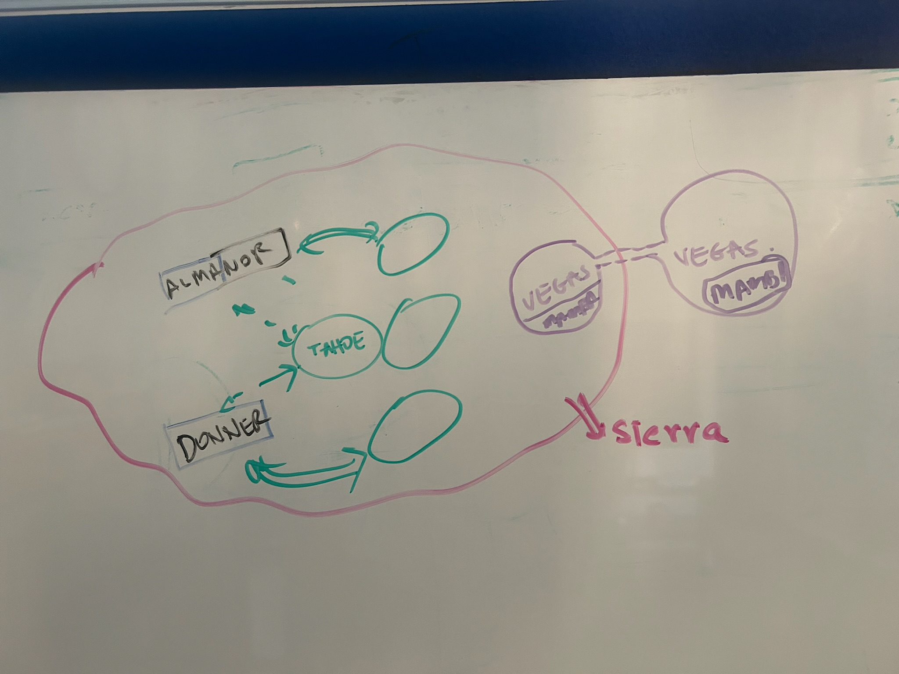

# SIERRA Control Center — Architecture

**Source sketch:** `docs/architecture/sierra-whiteboard-sketch.jpg`  
**Date:** 2026-05-03  
**Status:** Requirements capture — work in progress

---

## 1. Executive Summary

The system has four tiers arranged from global brain to field edge:

```
VEGAS tier    2–3 global brain centers (H100/H200, training)     ← top of hierarchy
     ↕ VPN
SIERRA zone   ~200 operational controllers (H100, mission exec)
     ├── TAHOE tier     large-lake named hubs    (3–4 per zone)
     └── Sub-tier       small-lake named nodes   (4–5 per hub)
     ↓
EDGE tier     ~100,000 drone masters (limited GPU, field)         ← leaf nodes
```

- **VEGAS** is the global brain — trains foundation models, coordinates the entire fleet. 2–3 geographically distributed centers. Each is a full H100/H200 cluster. Connected to SIERRA via VPN.
- **SIERRA** is the secure operational zone in Las Vegas. Contains TAHOE-tier hubs and their sub-controllers. All mission execution, regional coordination, and tactical inference happen here.
- **EDGE** nodes are drone masters deployed at the field periphery. Limited GPU, autonomous capable, failover to backup controller on primary loss.
- **mamba** is one operator node within the VEGAS tier — it may be physically anywhere and always connects via VPN.

---

## 2. Revised Topology

```
┌─────────────────────────────────────────────────────────────────────────────┐
│  VEGAS TIER  — Global Brain Centers  (2–3 sites, H100/H200 clusters)        │
│                                                                              │
│   ┌─────────────────────┐   ┌─────────────────────┐   ┌──────────────────┐ │
│   │  MEAD               │   │  POWELL             │   │  HAVASU          │ │
│   │  H200 ×128          │   │  H200 ×128          │   │  H200 ×64        │ │
│   │  Foundation models  │   │  Foundation models  │   │  (future)        │ │
│   └─────────┬───────────┘   └──────────┬──────────┘   └────────┬─────────┘ │
│             │  (mamba, operator nodes also live in this zone)   │           │
└─────────────┼───────────────────────────────────────────────────┼───────────┘
              │  VPN — encrypted fabric (WireGuard / IPSec)       │
              └──────────────────────┬────────────────────────────┘
                                     │
┌────────────────────────────────────┼────────────────────────────────────────┐
│  SIERRA  — Secure Operational Zone │Las Vegas, NV)                          │
│                                    │                                        │
│     ┌──────────────────────────────┼────────────────────────────────────┐   │
│     │  TAHOE Tier  (hubs)          │                                    │   │
│     │                                                                   │   │
│     │  ┌─────────┐   ┌─────────┐  ┌─────────┐   ┌─────────┐           │   │
│     │  │ TAHOE   │   │ SHASTA  │  │ OROVILLE│   │BERRYESSA│           │   │
│     │  │ (hub)   │   │         │  │         │   │         │           │   │
│     │  └────┬────┘   └────┬────┘  └────┬────┘   └────┬────┘           │   │
│     │       │              │            │              │                │   │
│     │  ┌────┴──────────────┴────────────┴──────────────┴─────────┐     │   │
│     │  │  Sub-controllers (ALMANOR / DONNER tier)                │     │   │
│     │  │  ALMANOR  DONNER  TENAYA  CASCADE  CONVICT  TOPAZ ...   │     │   │
│     │  └─────────────────────────────┬───────────────────────────┘     │   │
│     └────────────────────────────────┼───────────────────────────────── ┘  │
│                                      │                                      │
└──────────────────────────────────────┼──────────────────────────────────────┘
                                       │  Secure link (encrypted + mutual auth)
                    ┌──────────────────┼──────────────────────────┐
                    │  EDGE Tier  (~100,000 drone masters)         │
                    │                                              │
                    │  drone-00001 ··· drone-50000 ··· drone-99999 │
                    │  Primary → TAHOE hub                        │
                    │  Failover → backup TAHOE hub                │
                    └──────────────────────────────────────────────┘
```

---

## 3. Tier Specifications

### 3.1 VEGAS Tier — Global Brain Centers

**Role:** Foundation model training, fleet-wide intelligence, global mission strategy, operator workstations.  
**Count:** 2–3 centers globally.  
**Access:** All nodes (including mamba) connect via VPN — physical location does not change security posture.

| Node | Lake | GPU | VRAM | Mem BW | Interconnect | Role |
|------|------|-----|------|--------|--------------|------|
| **MEAD** | Lake Mead, NV — largest US reservoir | 16× H200 SXM5 | 16 × 141 GB = **2.2 TB** | 76.8 TB/s | NVLink 4, NDR 400 GbE | Primary brain — foundation model training |
| **POWELL** | Lake Powell, UT/AZ | 16× H200 SXM5 | 16 × 141 GB = **2.2 TB** | 76.8 TB/s | NVLink 4, NDR 400 GbE | Secondary brain — training + inference |
| **HAVASU** | Lake Havasu, AZ | 8× H100 SXM5 | 8 × 80 GB = **640 GB** | 26.8 TB/s | NVLink 3, HDR 200 GbE | Tertiary / future site |
| mamba | — | RTX 3070 Ti | 8 GB | 448 GB/s | 1 GbE | Operator workstation — VPN node |

**Per-center compute (MEAD / POWELL):**
- FP8 FLOPS: 16 × 3,958 TFLOPS ≈ **63 PFLOPS**
- Storage: 4 PB NVMe per center
- Network fabric: InfiniBand NDR (400 Gb/s) within cluster
- Power: ~14 kW per H200 node × 16 = ~224 kW GPU only per center

---

### 3.2 TAHOE Tier — Operational Hubs (inside SIERRA)

**Role:** Regional mission coordination, tactical AI inference, EDGE fleet management, mission-scoped training.  
**Count:** ~200 nodes total across all hubs.  
**Naming:** Large California lakes.

| Node | Lake | GPU | VRAM | Mem BW | Interconnect | Role |
|------|------|-----|------|--------|--------------|------|
| **TAHOE** | Lake Tahoe, CA/NV — alpine, deepest in Sierra | 8× H100 SXM5 | 8 × 80 GB = **640 GB** | 26.8 TB/s | NVLink 3, HDR 200 GbE | Hub controller — all sub-tier sync through here |
| **SHASTA** | Lake Shasta, CA — largest CA reservoir | 8× H100 SXM5 | 640 GB | 26.8 TB/s | NVLink 3, HDR 200 GbE | Northern operational zone |
| **OROVILLE** | Lake Oroville, CA — second largest CA reservoir | 4× H100 SXM5 | 4 × 80 GB = **320 GB** | 13.4 TB/s | HGX H100-4, HDR 200 GbE | Central operational zone |
| **BERRYESSA** | Lake Berryessa, CA | 4× H100 SXM5 | 320 GB | 13.4 TB/s | HGX H100-4, HDR 200 GbE | Southern operational zone |
| **FOLSOM** | Folsom Lake, CA — near Sacramento | 4× H100 PCIe | 4 × 80 GB = **320 GB** | 8.0 TB/s | PCIe 5.0 x16, 100 GbE | Reserve / overflow capacity |

**Per-node compute (8× H100 config):**
- FP8 FLOPS: 8 × 3,958 TFLOPS ≈ **32 PFLOPS**
- Storage: 200 TB NVMe per node
- Network: InfiniBand HDR (200 Gb/s) to cluster fabric
- Power: ~700 W × 8 H100 = ~5.6 kW GPU per node

---

### 3.3 Sub-Controller Tier — ALMANOR / DONNER Class

**Role:** Sub-regional data aggregation, pre-processing, lightweight inference, buffering between TAHOE hubs and EDGE nodes.  
**Count:** 4–5 sub-controllers per TAHOE hub → ~800–1,000 nodes total.  
**Naming:** Small California alpine lakes.

| Node | Lake | GPU | VRAM | Mem BW | Interconnect | Role |
|------|------|-----|------|--------|--------------|------|
| **ALMANOR** | Lake Almanor, CA — near Lassen | 2× L40S | 2 × 48 GB = **96 GB** | 1.7 TB/s | PCIe 4.0, 25 GbE | CV inference, pre-processing |
| **DONNER** | Donner Lake, CA — near Truckee | 2× L40S | 96 GB | 1.7 TB/s | PCIe 4.0, 25 GbE | CV inference, pre-processing |
| **TENAYA** | Tenaya Lake, CA — Yosemite | 2× RTX 6000 Ada | 2 × 48 GB = **96 GB** | 1.7 TB/s | PCIe 4.0, 25 GbE | Edge aggregation + inference |
| **CASCADE** | Cascade Lake, CA — near Tahoe | 2× RTX 6000 Ada | 96 GB | 1.7 TB/s | PCIe 4.0, 10 GbE | Edge aggregation |
| **CONVICT** | Convict Lake, CA — near Mammoth | 1× L40S | 48 GB | 864 GB/s | PCIe 4.0, 10 GbE | Lightweight relay / inference |
| **TOPAZ** | Topaz Lake, CA/NV — near Bridgeport | 1× RTX 4090 | 24 GB | 1.0 TB/s | PCIe 4.0, 10 GbE | Minimal relay node |

---

### 3.4 EDGE Tier — Drone Masters

**Role:** Local drone swarm control, real-time sensor fusion, field inference. Operates semi-autonomously.  
**Count:** ~100,000 nodes.  
**Naming:** Sequential (`edge-00001` … `edge-99999`) — no lake names at this scale.

| Class | Example | GPU | VRAM | Mem BW | Connectivity | Role |
|-------|---------|-----|------|--------|-------------|------|
| **Standard** | edge-00001 | 1× RTX 4090 | 24 GB GDDR6X | 1.0 TB/s | 1 GbE / 5G | Swarm control + inference |
| **Lite** | edge-50000 | 1× RTX 3070 | 8 GB GDDR6 | 448 GB/s | Wi-Fi / radio | Inference only |
| **Minimal** | edge-99000 | Jetson AGX Orin | 32 GB unified | 204 GB/s | Radio mesh | Ultra-light deployments |

**Failover behavior:**
1. Heartbeat timeout detected → retry primary (3× with backoff)
2. Primary unreachable → connect to backup controller (pre-assigned)
3. Sync operational state with backup
4. Continue mission under backup custody
5. Primary recovers → operator-directed custody transfer back

---

## 4. Node Registry

| Name | Tier | Lake | Size class | Status |
|------|------|------|------------|--------|
| MEAD | VEGAS Brain | Lake Mead, NV | Very large | Planned |
| POWELL | VEGAS Brain | Lake Powell, UT/AZ | Very large | Planned |
| HAVASU | VEGAS Brain | Lake Havasu, AZ | Large | Future |
| mamba | VEGAS Operator | — | Workstation | Active |
| TAHOE | SIERRA Hub | Lake Tahoe, CA/NV | Large alpine | Active |
| SHASTA | SIERRA Hub | Lake Shasta, CA | Large reservoir | Planned |
| OROVILLE | SIERRA Hub | Lake Oroville, CA | Large reservoir | Planned |
| BERRYESSA | SIERRA Hub | Lake Berryessa, CA | Medium reservoir | Planned |
| FOLSOM | SIERRA Hub | Folsom Lake, CA | Medium reservoir | Reserve |
| ALMANOR | Sub-controller | Lake Almanor, CA | Small mountain | Active |
| DONNER | Sub-controller | Donner Lake, CA | Small alpine | Active |
| TENAYA | Sub-controller | Tenaya Lake, CA | Small alpine | Planned |
| CASCADE | Sub-controller | Cascade Lake, CA | Small alpine | Planned |
| CONVICT | Sub-controller | Convict Lake, CA | Small alpine | Planned |
| TOPAZ | Sub-controller | Topaz Lake, CA/NV | Small | Planned |
| edge-XXXXX | EDGE | — | — | ~100,000 |

---

## 5. Security Zones

| Zone | Boundary | Access | Trust |
|------|----------|--------|-------|
| VEGAS Brain | Physical datacenter + VPN | Staff + VPN cert | Full |
| SIERRA | Physical perimeter + VPN gateway | VPN only | Full |
| EDGE | None (field-deployed) | Mutual TLS cert | Constrained |
| mamba | VPN only | User cert + MFA | Operator |

---

## 6. Open Requirements

### VPN & Network
- [ ] VPN topology: hub-and-spoke (SIERRA as hub) vs. full mesh between VEGAS + SIERRA
- [ ] VPN technology selection: WireGuard / IPSec / custom
- [ ] Certificate authority for EDGE mutual auth (~100,000 certs)
- [ ] Network segmentation: VEGAS fabric ↔ SIERRA fabric ↔ EDGE links
- [ ] Bandwidth requirements: VEGAS ↔ SIERRA training gradient sync

### Controller Software
- [ ] TAHOE hub: controller registration, health, failover logic
- [ ] EDGE onboarding: node enrollment, cert issuance, controller assignment
- [ ] Backup controller assignment strategy (static table vs. discovery)
- [ ] Heartbeat protocol: interval, timeout, retry policy
- [ ] State sync: what operational state is synced on failover, format, frequency
- [ ] Custody transfer protocol on primary recovery

### Training Infrastructure
- [ ] VEGAS ↔ TAHOE model distribution pipeline
- [ ] Gradient sync between MEAD and POWELL (distributed training across sites)
- [ ] Model versioning and rollout strategy to EDGE fleet
- [ ] Training data storage and access from VEGAS sites

### Hardware (SIERRA)
- [ ] H100 node procurement for TAHOE, SHASTA, OROVILLE, BERRYESSA (~200 nodes)
- [ ] Physical rack layout (see `platform/gpu/` inventory for current state)
- [ ] Power + cooling: ~5.6 kW × 200 nodes = ~1.1 MW GPU-only load in SIERRA
- [ ] InfiniBand fabric design for TAHOE cluster

### EDGE Fleet
- [ ] Hardware standardization: Standard / Lite / Minimal classes
- [ ] Autonomous operation floor: minimum capability when disconnected
- [ ] Over-the-air model update mechanism
- [ ] Secure boot + hardware attestation

---

## 7. Source Diagram

Original whiteboard sketch — 2026-05-03:



**Elements visible:**
- **Pink boundary** = SIERRA secure zone
- **TAHOE** (green center oval) = hub, bidirectional sync with ALMANOR (top) and DONNER (bottom)
- **Green unlabeled ovals** = GPU compute nodes attached to each controller
- **VEGAS** (purple, outside boundary) = two bubbles — one larger brain center, one with MAMBA — connected to SIERRA via dashed VPN line

---

## 8. Decision Log

| Date | Decision | Rationale |
|------|----------|-----------|
| 2026-05-03 | California lakes naming convention | Geographically rooted, memorable, no vendor lock-in |
| 2026-05-03 | TAHOE = SIERRA hub | Established as primary node in existing work |
| 2026-05-03 | VEGAS tier = H100/H200 brain | 2–3 centers are the top of the training hierarchy |
| 2026-05-03 | MEAD + POWELL = primary brain nodes | Largest western reservoirs matching top-tier scale |
| 2026-05-03 | Sub-tier = L40S / RTX 6000 Ada | Best CV balance at sub-controller scale |
| 2026-05-03 | EDGE target: ~100,000 | Per mission scale; failover is autonomous |
| 2026-05-03 | mamba = operator node, VEGAS tier | VPN-only access; location-agnostic security posture |
